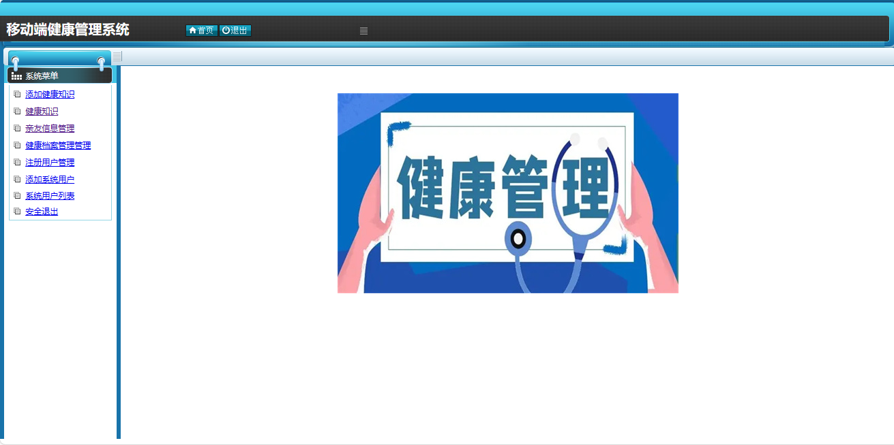
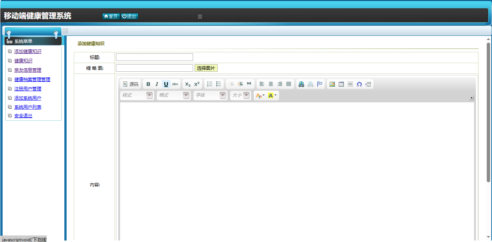
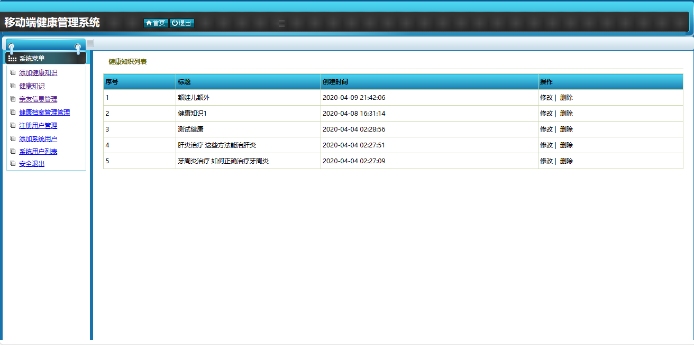
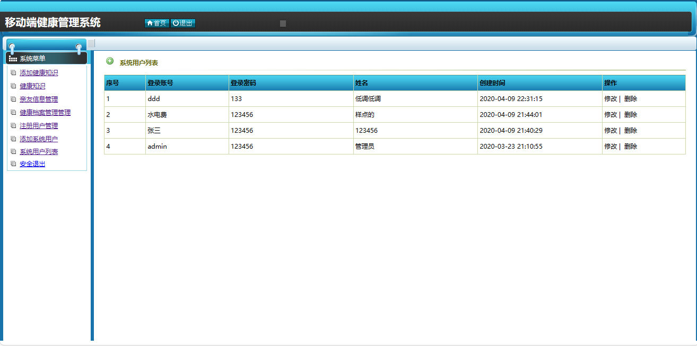

<h1 align="center">移动端健康管理系统</h1>

QQ群: 377586148(加群获取sql文件)

 [个人站点: 从戎源码网](https://armycodes.com/)

## 简介

> 本代码来源于网络,仅供学习参考使用!
>
> 提供1.远程部署/2.修改代码/3.设计文档指导/4.框架代码讲解等服务
>
> 管理员登录地址：http://localhost:8080/login.jsp
>
> 管理员: admin   密码: 123456
>

## 项目介绍

移动端健康管理系统：前端 Jsp、ckeditor，后端 Servlet，健康管理软件系统可以帮助个人更好地管理自己的健康,预防疾病,改善生活质量。

### 主要功能：

- 基本功能：登录、安全退出
- 健康知识：添加健康知识（标题、缩略图上传、内容富文本编辑）、健康知识列表、健康知识编辑、健康知识删除、健康档案管理
- 用户管理：注册用户管理、注册用户编辑、注册用户删除、注册用户列表、系统用户列表、系统用户添加、亲友信息列表

## 环境

- <b>IntelliJ IDEA 2009.3</b>

- <b>Mysql 5.7.26</b>

- <b>Tomcat 7.0.73</b>

- <b>JDK 1.8</b>

## 运行截图

