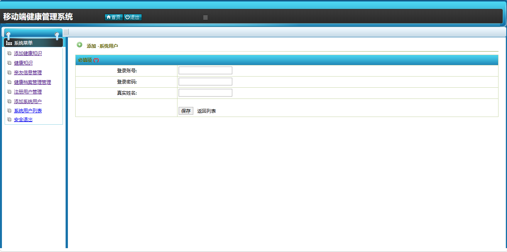

<h1 align="center">移动端健康管理系统</h1>

- <b>完整代码获取地址：从戎源码网 ([https://armycodes.com/](https://armycodes.com/))</b>
- <b>技术探讨、资料分享，请加QQ群：692619798</b> 
- <b>作者微信：19941326836  QQ：952045282</b> 
- <b>承接计算机毕业设计、Java毕业设计、Python毕业设计、深度学习、机器学习</b>
- <b>选题+开题报告+任务书+程序定制+安装调试+论文+答辩ppt 一条龙服务</b>
- <b>所有选题地址 ([https://github.com/YuLin-Coder/AllProjectCatalog](https://github.com/YuLin-Coder/AllProjectCatalog)) </b>

## 项目介绍

移动端健康管理系统：前端 Jsp、ckeditor，后端 Servlet，健康管理软件系统可以帮助个人更好地管理自己的健康,预防疾病,改善生活质量。

### 主要功能：

- 基本功能：登录、安全退出
- 健康知识：添加健康知识（标题、缩略图上传、内容富文本编辑）、健康知识列表、健康知识编辑、健康知识删除、健康档案管理
- 用户管理：注册用户管理、注册用户编辑、注册用户删除、注册用户列表、系统用户列表、系统用户添加、亲友信息列表

## 环境

- <b>IntelliJ IDEA 2009.3</b>

- <b>Mysql 5.7.26</b>

- <b>Tomcat 7.0.73</b>

- <b>JDK 1.8</b>

## 运行截图

